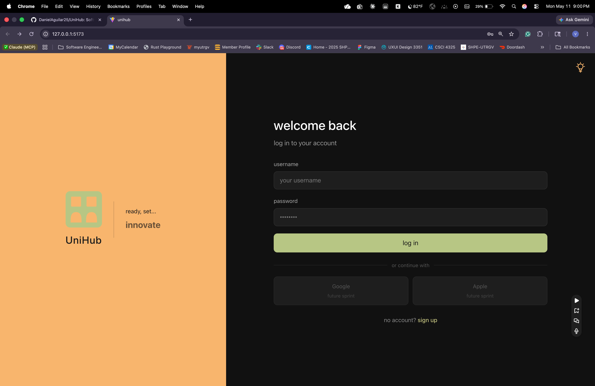
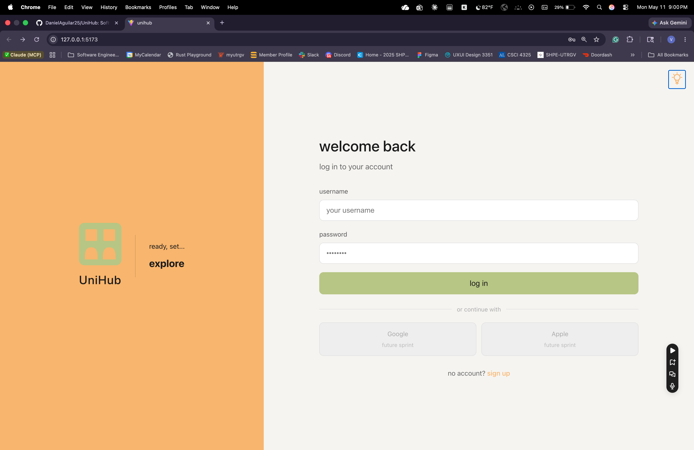
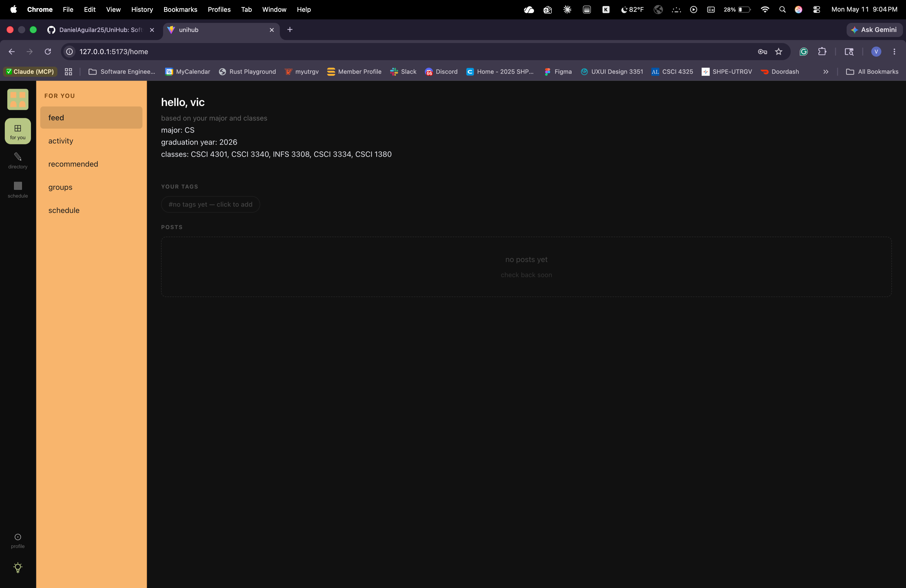
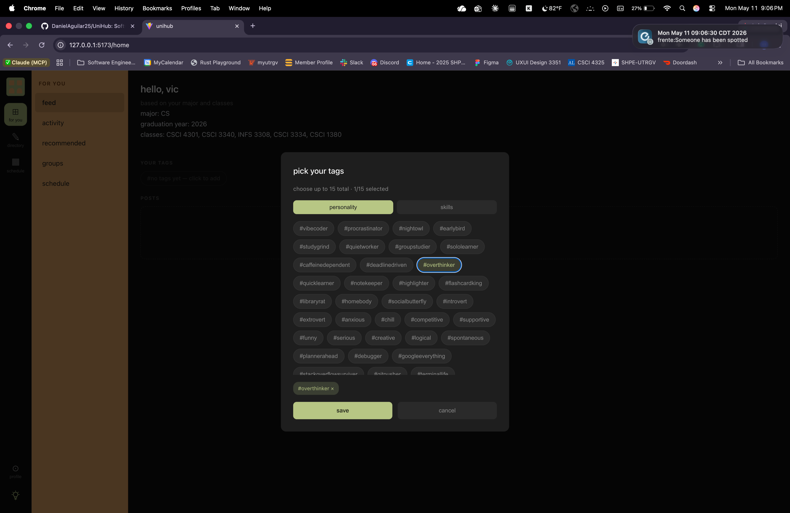
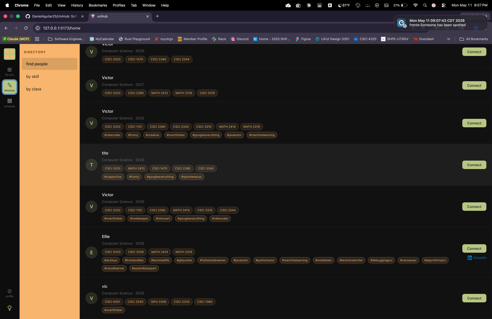
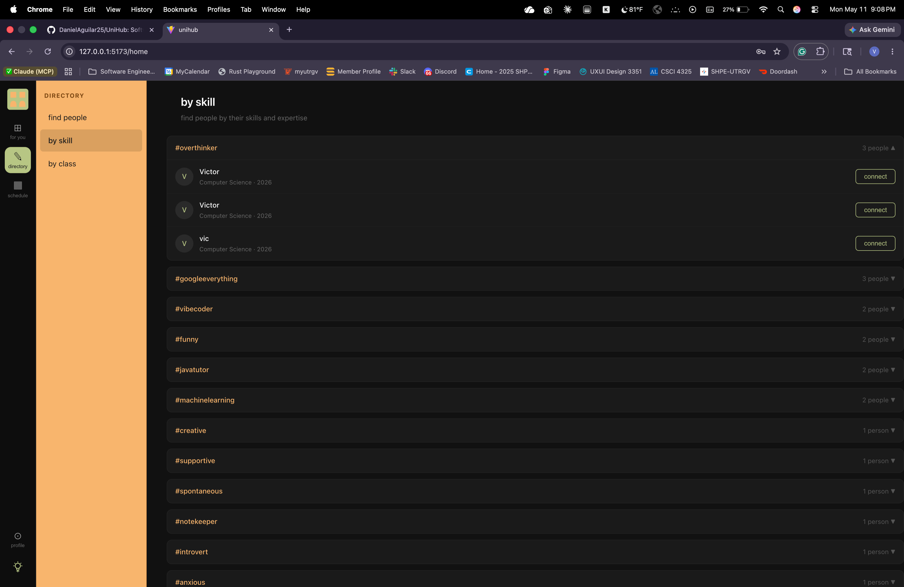
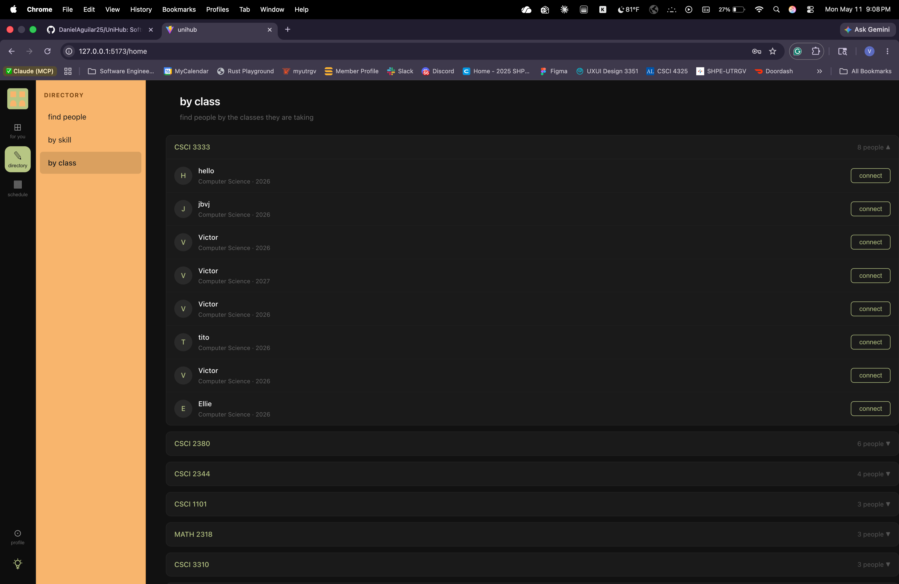
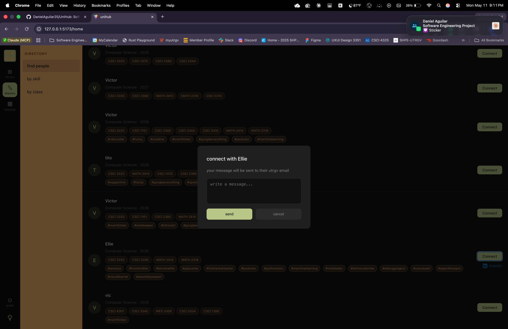
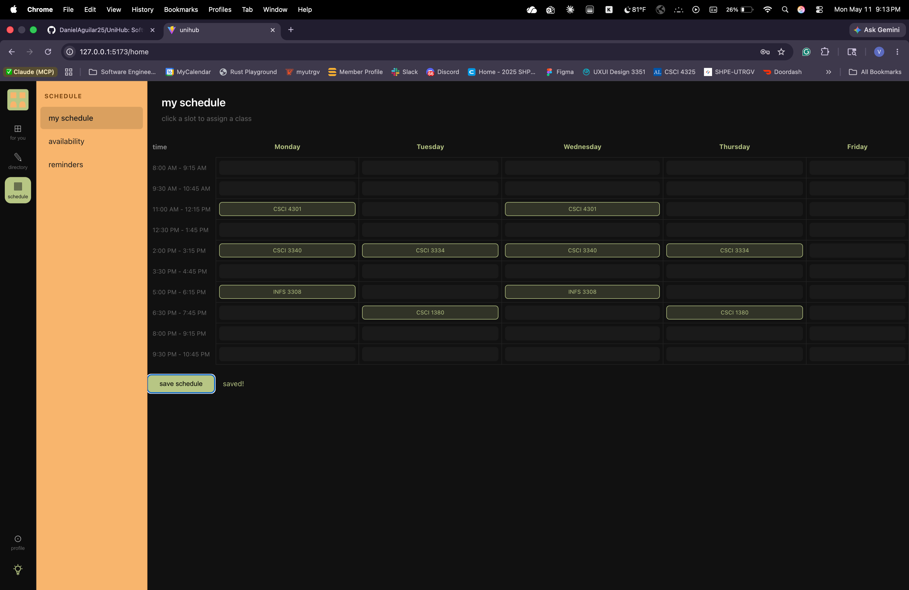
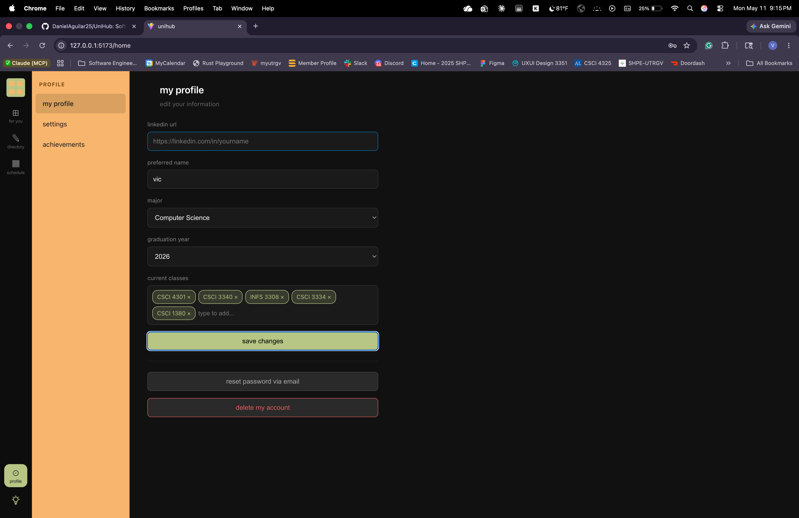

# UniHub

A campus platform built exclusively for UTRGV CECS students. One place to find study partners, manage your schedule, and connect with classmates.

[take screenshot of: the login page]

---

## What is UniHub?

UniHub is a social platform for UTRGV College of Engineering and Computer Science students. It lets you find people in your classes, connect with them over email, build a weekly schedule, and express your personality and skills through hashtags.

---

## Tech Stack

**Frontend:** React + Vite  
**Backend:** Django (Python)  
**Database:** SQLite  
**Auth:** Django session-based authentication  
**Email:** Gmail SMTP via Django  

---

## Features

### Signup & Login
- UTRGV email validation (@utrgv.edu only)
- Secure password hashing via Django
- Searchable course tag input with full CECS catalog
- Support for all 8 CECS majors





---

### For You Feed
- Personalized greeting with your name, major, grad year, and classes
- Your personality and skill hashtags displayed as tags
- Click to add or edit your hashtags at any time



---

### Hashtags
- Two tabs: personality tags (green) and skill tags (orange)
- Pick up to 15 total
- Tags show on your profile card in the directory



---

### Directory
Three ways to find people:

**Find People** — search by name or course, see everyone's classes and hashtags, connect via email  



**By Skill** — browse collapsible boxes of skill hashtags, see who has each one  



**By Class** — browse collapsible boxes by course code, see who is taking each class  


---

### Connect
- Click Connect on any student card
- Write a message in the modal
- Message is sent directly to their UTRGV inbox via Gmail SMTP
- Button changes to "sent ✓" after sending
- LinkedIn link appears on cards if the student has added one



---

### Schedule Builder
- Monday through Friday grid with time slots from 8AM to 10:45PM
- Click any cell to assign a class from your current courses
- Schedule saves to the database and persists on next login



---

### Profile
Edit your information at any time:
- LinkedIn URL
- Preferred name
- Major
- Graduation year
- Current classes

Additional options:
- **Reset password via email** — generates a new 12-character password and sends it to your UTRGV email
- **Delete account** — permanently removes your account after password confirmation



---

## How to Run Locally

### Prerequisites
- Python 3.10+
- Node.js 18+
- A Gmail account with an App Password

### Backend Setup
```bash
cd backend
pip install -r requirements.txt
python manage.py migrate
python manage.py createsuperuser
python manage.py runserver
```

Create a `.env` file in the backend folder:
EMAIL_HOST_USER=your@gmail.com
EMAIL_HOST_PASSWORD=your_app_password

### Frontend Setup
```bash
npm install
npm run dev
```

Create a `.env` file in the root folder:
VITE_API_URL=http://127.0.0.1:8000

Open `http://localhost:5173` in your browser.

---

## How to Use UniHub

1. Go to `/signup` and create an account with your UTRGV email
2. Pick your major, graduation year, and current classes
3. Log in and see your personalized For You feed
4. Go to your profile and add your LinkedIn URL and hashtags
5. Go to Directory → Find People to search for classmates
6. Click Connect to send them a message to their UTRGV inbox
7. Go to Directory → By Skill or By Class to browse by tag
8. Go to Schedule to build your weekly class grid

---

## Team

| Name | Role |
|------|------|
| Victor Chairez | Backend, API, database, email system, schedule, hashtags |
| Daniel Aguilar | Frontend components, UI structure, navigation |
| Elyssa Guajardo | Documentation, testing, QA |

---

## Admin

Django admin is available at `/admin/`. Use your superuser credentials to manage users and profiles.